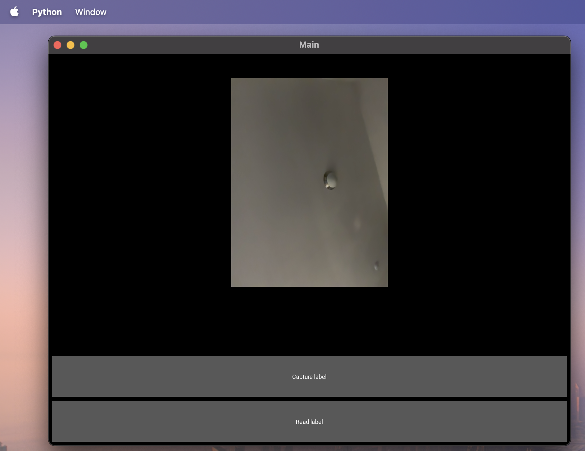

# Enterprise-AI-Project
This repo is created to facilitate collaboration for the enterprise AI project

To run this application locally on your machine you'll need to install the following

First clone the app using git clone https://github.com/abarrygcp16/Enterprise-AI-Project.git

Install the followings

pip install kivy

pip install pillow

pip install azure-cognitiveservices-speech

pip install azure-cognitiveservices-vision-computervision

pip install msrest

A virtual environment is setup to run the app locally you can clone the repo and active the environment with the following command.

# On Windows
.\venv\Scripts\activate
# On macOS/Linux
source venv/bin/activate

To run the application cd into the project folder and run the following code python app/main.py

I successfully ran this app and here are screenshot 

